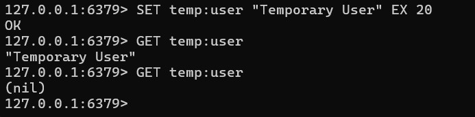

# Redis_OLA# Redis OLA Assignment – Database Course

`Name:` Timothy Busk Mortensen  
`Platform:` Windows 11  
`Course:` Database Systems

This document contains the Redis OLA assignment.

## What is Redis?

Redis (REmote DIctionary Server) is an open-source, in-memory key-value database known for its high performance, simplicity, and versatility. It supports various data structures such as strings, hashes, lists, sets, and sorted sets. Redis is often used for caching, session management, real-time analytics, pub/sub messaging, and as a lightweight database. Unlike traditional SQL databases, Redis stores data in memory as key-value pairs instead of using relational tables with rows and columns.

## How Redis Was Installed

Redis was installed using Docker on Windows. The official Redis image was pulled from Docker Hub and used to create isolated Redis containers.

```bash
# Download the official Redis image
docker pull redis
```

## Running a Redis Container

To start a Redis container(start the redis open-source server), with the name `redis-retention`, and expose it on your local machine on port 6379:

```bash
docker run -d --name redis-retention -p 6379:6379 redis
```

## Connecting to the Redis Server Using Redis CLI

Once the Redis container is running, connect to it using the Redis CLI with the following command:

```bash
docker exec -it redis-retention redis-cli
```

---


## Assignment Overview

**Title:** Redis Configuration and Implementation  
**Objective:** Implement different Redis configurations and demonstrate their functionality using the Redis CLI or Redis Telnet CLI.

### Scenario
You have been hired as a software architect for a company that provides online gaming services. The company wants to use Redis as one of its databases to store relevant information, game statistics, and other related data.

### Task Summary
- Choose and set up **a minimum of 2 out of 5 Redis configurations**
- Develop **1 simple application, website, or API** that uses at least one of the configurations
- Ensure the application supports **CRUD operations against Redis**
- Use **Docker or virtual machines** to simulate setups involving multiple machines (if required)
---


## Configuration 1: Redis with Retention Policy

### Objective
Implement a retention policy in Redis so that user data is automatically deleted after a set time period (24 hours). This helps manage memory efficiently and is useful for temporary data like API caching or user sessions.

### Task 1: Install Redis on your machine and configure it to run on the default port (6379)

Redis was installed and run using Docker. The following command creates and starts a Redis container exposed on the default port:

```bash
docker run -d --name redis-retention -p 6379:6379 redis
```


### Task 2: Set up a retention policy that automatically deletes keys after 24 hours

Redis does not require a separate configuration file to enable expiration. Instead, key expiration is set directly when storing data using the `EX` (expire) option. To connect to the Redis CLI:

```bash
docker exec -it redis-retention redis-cli
```

Then we store a key with 24 TTL(time to live):
```bash
SET user:1001 "{\"name\": \"Alice\", \"email\": \"alice@example.com\", \"age\": \"25\"}" EX 86400
```


### Task 3: Store user data in Redis

Multiple user records were added using Redis hashes and strings, all with expiration set to 24 hours:

```redis
SADD users "Alice" "Bob" "Charlie"

HSET user:Alice name "Alice" email "alice@example.com" age "25"
EXPIRE user:Alice 86400

HSET user:Bob name "Bob" email "bob@example.com" age "30"
EXPIRE user:Bob 86400

HSET user:Charlie name "Charlie" email "charlie@example.com" age "35"
EXPIRE user:Charlie 86400
```

- `HSET`: Stores multiple field-value pairs in a Redis **hash**. Useful for representing structured objects like user profiles.
- `SADD`: Adds one or more members to a **set**. In this case, used to track a list of usernames.
- `EXPIRE`: Sets a **TTL (Time To Live)** on a key. After the specified number of seconds, the key will be automatically deleted by Redis.


### Task 4: Wait for 24 hours and verify that expired keys are automatically deleted from Redis

To confirm that the retention policy works, a test key was created with a short expiration time (e.g., 10 seconds):

```redis
SET temp:user "Temporary User" EX 20
```

```redis
GET temp:user      # Returns the value if not expired
# Wait 20 seconds
GET temp:user      # Returns (nil) – the key has expired
```

### Screenshot: Redis Retention Policy in Action

Below is a screenshot showing the Redis CLI with a key being created using `SET` and an expiration (`EX`), followed by `GET` showing the key has been deleted after expiration:



To see the list of users added to the `users` set, use the following command in the Redis CLI:

```redis
SMEMBERS users
```


To check how much time is left before a key expires, use the `TTL` command:

```redis
TTL user:Alice
```
